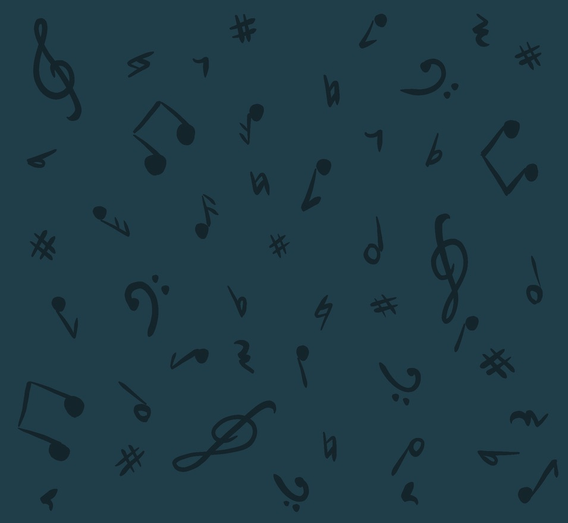

# Instruments Of The Orchestra

Instruments Of The Orchestra is a fun and interactive quiz aimed at school children who have an interest in music or have recently started learning a musical instrument. The aim of the quiz is to teach school children about the different instruments used in an orchestra.


The image above is a screenshot of the site displayed on different devices using [Am I Responsive](http://ami.responsivedesign.is/).

A demo of the website can be found here: [www.instrumentsoftheorchestra.com](https://kirstchat.github.io/instruments-of-the-orchestra/)

---

## Contents

- [**User Experience (UX)**](<#user-experience-(ux)>)

  - Project Goals
  - User Goals
  - Design
    - Colour Scheme
    - Typography
    - Imagery
  - Wireframes

- [**Features**](#features)

  - Features that have been implemented
  - Features left to be implemented

- [**Technologies**](#technologies-used)

  - Languages Used
  - Frameworks, Libraries and Programs Used

- [**Testing**](#testing)

- [**Deployment**](#deployment)

- [**Credits**](#credits)
  - Code
  - Content
  - Media
  - Acknowledgements

---

## User Experience (UX)

### Project Goals

The goal of this project is to create a fun and interactive quiz aimed at school children that will allow them to learn about the different instruments used in an orchestra. Throughout the quiz, the user will learn more about the different instruments and instrument families in the orchestra by being presented with a fact when they answer a question correctly. If a user answers incorrectly, they will be asked to try again until they choose the correct answer. The quiz is designed to be a learning tool and doesn't keep a score of the questions the user has answered correctly. By creating this quiz, I hope to help school children learn more about the orchestra and encourage them to take an interest in music.

### User Goals

- As a **user**, I want to easily understand the main purpose of the site on my first visit
- As a **user**, I want to be able to easily navigate through the site
- As a **user**, I want to learn about the different instruments used in an orchestra
- As a **user**, I want to have a fun playing the quiz and also have fun learning
- As a **user**, I want feedback as I answer each of the questions in the quiz
- As a **user**, I want to be able to easily contact the site owner to provide feedback about the quiz
- As a **user**, I want to see what other projects the site owner has created

### Site Owner Goals

- As a **site owner**, I want the user to be greeted with a welcome message with a short explanation on what the site is so the user instantly understands the purpose of the site
- As a **site owner**, I want to include links on all pages of the site to allow the user to easily navigate to other pages
- As a **site owner**, I want to create a quiz that will teach the user about the different instruments used in an orchestra
- As a **site owner**, I want to provide the use with feedback when they answer each question to let them know if their answer is correct or incorrect
- As a **site owner**, I want to create a fun and interactive experience for the user that will engage them throughout
- As a **site owner**, I want to include a feedback form to allow the user to easily contact me and leave feedback about the quiz and/or the website itself
- As a **site owner**, I want to include links to my GitHub profile and my LinkedIn profile so the user can see other projects I've worked on

### Design

As this project is aimed at school children, I wanted to create a fun and colorful design that will engage the user and keep them interested throughout.

The layout of the site is simple and easy to follow with navigation buttons at the top, the main content in the middle and social/contact buttons in the footer. The overall site is made up of two pages:

- **index.html** - this includes the welcome message and all the quiz content as well the navigation links in the header and footer of the site.
- **contact.html** - this includes the feedback from as well as the navigation links in the header and the footer of the site.

#### Colour Scheme

_Colour palettes generated using [coolors.co](https://coolors.co/f94144-f67584-f8961e-f9c74f-90be6d-43aab1-264653)_


I chose a bright colour scheme for the site that features both primary and secondary colours as seen in the image above. I used these colours for all the buttons that the user interacts with throughout the quiz and for various other buttons on the website. The intention of the bright colours is to grab the users attention and encourage them to interact with the website.

To help the main content of the page stand out, I chose a dark blue/navy for the background. I then set the colour of the main content container in the centre of the site to white to help make the container stand out from the background. I also used white for button text as this was easier to read and also for the navigation icons used in the header and footer of the site as this also helped the icons stand out from the background.


For the button hover states, I darkened each of these colours by three shades which can be seen in the image above. When the user hovers over a button they will see a "pressed" button effect and the button will change to the darker colour. I also used an even darker blue/navy for the main text as well as the music symbols drawn on the background colour.

#### Typography

Throughout the site, I used two fonts - [ABeeZee Font](https://fonts.google.com/specimen/ABeeZee?preview.text_type=custom&query=abee) and [Grandstander Font](https://fonts.google.com/specimen/Grandstander?preview.text_type=custom&category=Display,Handwriting,Monospace&query=grand).

I chose the ABeeZee font as it was described as a font suitable for children that is simple and easy to read. It is used as the main font throughout the site:

>"ABeeZee is a children's learning font. Open, friendly and simple, the definite shapes support the process of learning to read and write. The italic carefully reminds young readers of fluent writing movements and inspires them to create their own unique handwriting."

I used the Grandstander font for the headings throughout the site as well as the quiz questions. I chose this font as it was easy to read but also "fun" looking which will hopefully make the site more appealing to the user.

#### Imagery

To make the background of the site more fun looking and appealing to the user, I drew a range of different music related symbols using [Procreate](https://procreate.art/ipad) on an iPad. For this, I used the dark blue/navy color as seen in the colour palette above.



To continue making the site more fun and appealing to the user, I used images of different musical instruments and images musicians throughout the quiz. The images featured in the quiz are all taken from various sources which can be found in the [credits](#images) section at the end of this document.

I used themed music icons in the about modal to represent the different instrument sections of the orchestra. I also used icons in the quiz for the try again message and the finish quiz message as well as for some of the quiz questions that I couldn't use an image for.

### Wireframes

The wireframes for my site were created using [Balsamiq](https://balsamiq.com/). I created wireframes for mobile, tablet and desktop devices.

The final design of the site closely follows the wireframe designs with the exception of following only one style of the quiz questions shown. This was due to some issues adding audio to only a few of the quiz questions in the initial phase of the project build. Instead, all the questions now include an audio source that can be played when the user answers the question correctly to hear what sound that specific instrument makes.

Links to the wireframes can be found below:

| Mobile | Tablet | Desktop |
| :----: | :----: | :-----: |
| [Home Page](https://github.com/KirstChat/instruments-of-the-orchestra/blob/master/assets/wireframes/home-mobile.pdf) | [Home Page](https://github.com/KirstChat/instruments-of-the-orchestra/blob/master/assets/wireframes/home-tablet.pdf) | [Home Page](https://github.com/KirstChat/instruments-of-the-orchestra/blob/master/assets/wireframes/home-desktop.pdf) |
| [Quiz Examples](https://github.com/KirstChat/instruments-of-the-orchestra/blob/master/assets/wireframes/quiz-examples-mobile.pdf) | [Quiz Examples](https://github.com/KirstChat/instruments-of-the-orchestra/blob/master/assets/wireframes/quiz-examples-tablet.pdf) | [Quiz Examples](https://github.com/KirstChat/instruments-of-the-orchestra/blob/master/assets/wireframes/quiz-examples-desktop.pdf) |
| [Contact Form](https://github.com/KirstChat/instruments-of-the-orchestra/blob/master/assets/wireframes/contact-form-mobile.pdf) | [Contact Form](https://github.com/KirstChat/instruments-of-the-orchestra/blob/master/assets/wireframes/contact-form-tablet.pdf) | [Contact Form](https://github.com/KirstChat/instruments-of-the-orchestra/blob/master/assets/wireframes/contact-form-desktop.pdf) |

[Contents](#contents)

---

## Features

### Features that have been implemented

- Responsive on all devices:
  - This site has a mobile-first design
  - Media queries have been added for tablet and laptop/desktop sized devices
- Easy to use navigation bar located at the top of every page with links to the home page/start of the quiz and the about modal
- A footer located on every page with links to my LinkedIn profile, GitHub profile and a feedback form located on the website
- A feedback form to allow the user to provide feedback on the quiz and/or contact the site owner
- An interactive quiz that gives the user feedback if the answer is correct or incorrect

### Features left to be implemented

- Option to add more questions:
  - All the questions are currently kept in the quiz.js file instead of a separate JSON file as the quiz is currently limited to 15 questions on each play through, with a total of 18 possible questions the user could be asked.
  - This option could be added when I've advanced further through the course and have an understanding of databases. This would be an easier and more efficient way to add more questions to the quiz.
  - With a database option to add more questions, a difficulty setting could be added to the quiz which would widen the target audience of the site as the questions added could be more difficult and therefore aimed at secondary school or even university students.

- Sound based questions:
  - With a bit more experience in JavaScript and further testing, I would like to add some sound based questions as seen in my wireframes. These questions would require the user to listen to a sound and guess the instrument from the sound rather than the image.

- Randomise the answer button order:
  - Currently, the answers all appear in the same order each time the quiz is ran. Like the questions, I would like to randomise the order of the answer buttons to add a bit more difficulty to the quiz.

- Learning Section:
  - I would later like to develop a separate learning section that could cover even more topics on the orchestra - not just the instruments.
  - Alongside this, I would create individual quizzes for each topic covered in the learning section and also create a main quiz that tests the users knowledge on all topics covered in the site.

[Contents](#contents)

---

## Technologies Used

### Languages

- [HTML5](https://developer.mozilla.org/en-US/docs/Web/HTML)
- [CSS3](https://developer.mozilla.org/en-US/docs/Web/CSS)
- [JavaScript](https://developer.mozilla.org/en-US/docs/Web/JavaScript)

### Frameworks, Libraries and Programs

- [Bootstrap v4.5](https://getbootstrap.com/)
  - Bootstrap was used to give the website a simple, responsive layout and to also add a modal feature on each page.
- [Google Fonts](https://fonts.google.com/)
  - Google Fonts was used to add the Grandstander and ABeeZee fonts to the site.
- [Font Awesome](https://fontawesome.com/)
  - Font Awesome was used to add icons for navigation links, social links and to buttons throughout the site.
- [Git](https://git-scm.com/)
  - Git was used for version control by utilising the terminal in VS Code to commit to Git and push to GitHub. Git was also used to create branches to test new features before merging with the master branch.
- [GitHub](https://github.com/)
  - GitHub was used to store the project code that was pushed from VS Code.
- [VS Code](https://code.visualstudio.com/)
  - Visual Studio Code was the IDE used to code the project.
- [Balsamiq](https://balsamiq.com/)
  - Balsamiq was used to create the wireframes for desktop, tablet and mobile during the design process.
- [EmailJS](https://www.emailjs.com/)
  - EmailJS was used to add an email service to the feedback form in the contact.html page.

[Contents](#contents)

---

## Testing

The W3C Markup Validator and the W3C CSS Validator were used to validate the html and css files in the project and to ensure there were no syntax errors. The following shows the results for each file:

- [W3C Markup Validator](https://validator.w3.org/)
  - index.html - No errors or warnings to show.
  - contact.html - Nor errors or warnings to show.

Upon running both html files through the validator for the first time, warnings were displayed for the use of "type" in the script tags. After removing these, both html files passed through the validator without any errors or warnings.

- [W3C CSS Validator](https://jigsaw.w3.org/css-validator/)
  - styles.css - No error found.
  - The validator did display a warning for the use of the root colour variable names.


JS Hint was used to check the javascript files in the project to ensure it complies with coding rules and that these were no syntax errors:

- [JS Hint](https://jshint.com/)
  - quiz.js - No warnings to show.
  - feedback.js - Found one undefined variable (emailjs) and one unused variable (sendMail).

Upon running both JavaScript files through JS Hint, there were a number of warnings for missing semicolons. There were also two warnings for the use of single quotes when calling the number dataset in quiz.js. After adding the relevant semicolons and replacing the single quotes with template literals, this fixed these issues in quiz.js and feedback.js.

### Testing User Stories from UX Section

As a **user**, I want to easily understand the main purpose of the site on my first visit

- I've added a welcome message to the main content container that will display when the user first opens the site.
- This contains the title of the website as well as a description on what the site is - _"a quiz that will teach you about the different instruments played in an orchestra"_.

As a **user**, I want to be able to easily navigate through the site

- I've added navigation links to the header of the site that link back to the home page and open the about modal.
- I've also added links in the footer that link to my GitHub profile, my LinkedIn profile and the feedback from on the site.

As a **user**, I want to learn about the different instruments used in an orchestra

- I've created a quiz that will teach the user about the different instruments and instrument sections in an orchestra.
- If the user guesses the answer to a question correctly, they will be provided with some facts about that specific instrument.
- If the user guesses incorrectly, they will be encourage to try again until they answer the question correctly.

As a **user**, I want feedback as I answer each of the questions in the quiz

- I've added a well done message and a try again message to each question.
- If the user guesses correctly, they 

As a **user**, I want to have a fun playing the quiz and also have fun learning

- I've

As a **user**, I want to be able to easily contact the site owner to provide feedback about the quiz

- I've added a feedback form to the site that the user can access from the footer and also when they finish the quiz.
- This gives the user the option to leave feedback about the quiz, feedback about the overall site or to ask any other questions they may have.

As a **user**, I want to see what other projects the site owner has worked on

- I've added links to my GitHub profile and my LinkedIn profile in the footer of the site.
- This will allow the user to see what other projects I've created and also provide them with additional way to contact me.

### Further Testing

As well as running each page through a validator and testing user stories, I also tested the responsiveness of the site across a number of different devices and browsers:

- The site was tested during the development process using Chrome DevTools to test the responsiveness on different devices before pushing any changes to GitHub.
- After pushing any changes, the site was also tested in Chrome, Safari and FireFox. The site was also tested again in these browsers on completion of the project.
- The site was also tested on personal devices in Chrome, Safari and Firefox. These devices include a MacBook Pro, iPad and iPhone 11.
- I also used a desktop app called [Responsively](https://responsively.app/) to check the responsiveness on the site on some additional android devices that I didn't have access to on Chrome DevTools.

As well as testing the responsiveness of the site, I also tested the performance of each page using [Lighthouse](https://developers.google.com/web/tools/lighthouse) in Chrome DevTools. The scores for each page can be found below:

Insert Images Later

Each page was also tested individually to check that:

- Images loaded properly
- Navigation buttons linked to the correct internal/external page
- External links opened in a new tab/window
- Form validation works

Each of the quiz questions were also tested individually to check that:

- 

The site was also tested and reviewed by my mentor as well as some Code Institute students on the peer-code-review channel.

- Quiz - Started following layout in Web Dev video but struggled to run a conditional on answers | Changed looping method to Fisher-Yates - considered to be more reliable | Changed method again to follow James Quick video on Building a JavaScript Quiz App
- Sound Based Questions and/or sound of each instrument on well done message - Test on a branch

### Known Bugs

Issue with audio repeating/playing at the same time as other audio clip when button is clicked in initial script - fixed with latest version.

Issue with question count - fixed with changing where getQuestions function was called

Created a branch to update the text content of the answer buttons from the object array in a different way. With the first version - I looped through the array to update the text, I was unable to find a way to see if the button clicked was true or false.

[Contents](#contents)

---

## Deployment

This project was coded using VS Code using the following steps from [Visual Studio Code Docs](https://code.visualstudio.com/docs/editor/github):

1. Opened Github and created a new repository.
2. Opened source control on VS Code and selected "Clone Repository".
3. When prompted, I signed in to my GitHub account on VS Code.
4. Searched for the new repository created on GitHub and selected the repository to clone.
5. After the repository was successfully cloned to my computer, I started creating files and folders.
6. I then used git bash to commit and push changes to the GitHub repository.

### GitHub Pages

The project was deployed to GitHub Pages using the following steps:

1. After pushing the project to GitHub, I opened the GitHub site and logged in.
2. After logging in, I located the repository for the project: [https://github.com/KirstChat/instruments-of-the-orchestra](https://github.com/KirstChat/instruments-of-the-orchestra)
3. At the top of the repository, I clicked on the "Settings" button.
4. On the settings page, I scrolled down to the "GitHub Pages" section.
5. Under "Source", I selected "Master Branch" from the dropdown menu.
6. After the page refreshed itself, I scrolled back down to the "GitHub Pages" section to retrieve the link to the published site.

The site can be viewed here: [https://kirstchat.github.io/instruments-of-the-orchestra/](https://kirstchat.github.io/instruments-of-the-orchestra/)

### Making a Local Clone

To clone the repository and make a local copy on your computer, follow these steps:

1. Open GitHub and locate the GitHub repository: [https://github.com/KirstChat/instruments-of-the-orchestra](https://github.com/KirstChat/instruments-of-the-orchestra)
2. Under the repository name, click "Code" or "Clone" and copy the link to clone the repository using "HTTPS".
3. After copying the link, open terminal on your computer. This step can also be done in the terminal on an IDE.
4. Change the current working directory to the location where you want the cloned directory to be saved.
5. Type git clone, and then paste the URL: [https://github.com/KirstChat/instruments-of-the-orchestra.git](https://github.com/KirstChat/instruments-of-the-orchestra.git)
6. Press Enter to create a local clone.

```bash
git clone https://github.com/KirstChat/instruments-of-the-orchestra.git
```

[Contents](#contents)

---

## Credits

### Code

The JavaScript code used to create the quiz was based around two tutorials found on YouTube. I originally started basing the code on the [Web Dev Simplified](https://www.youtube.com/channel/UCFbNIlppjAuEX4znoulh0Cw) video on how to [Build a Quiz App with Javascript](https://www.youtube.com/watch?v=riDzcEQbX6k&list=PLyn9ak24qaCvBSsurq-Q1fGKEXXUzsJmf&index=2&t=718s) before discovering [James Q Quicks](https://www.youtube.com/channel/UC-T8W79DN6PBnzomelvqJYw) video on how to [Build a Quiz App (3)](https://www.youtube.com/watch?v=zZdQGs62cR8&list=PLDlWc9AfQBfZIkdVaOQXi1tizJeNJipEx&index=5). This approach worked better for the type of quiz I was aiming to build for this project.

Other tutorials and code examples used in the project:

- [W3 Schools: How to Animate Buttons](https://www.w3schools.com/howto/tryit.asp?filename=tryhow_css_buttons_animate3) - This was used to add a "pressed" effect to all buttons throughout the site.

- [W3: Favicon](https://www.w3.org/2005/10/howto-favicon) - This was used to learn how to add a favicon to the site.

- [JavaScript Info: Fisher-Yates Shuffle](https://javascript.info/task/shuffle) - This was initially used to try a different approach to shuffle the questions array before settling on using math functions instead.

- [FreeCodeCamp: Button Loop](https://www.freecodecamp.org/news/master-the-art-of-looping-in-javascript-with-these-incredible-tricks-a5da1aa1d6c5/) - This was initially used to test different ways of looping through buttons to see which worked best for updating the inner text of the buttons.

### Content

- All content on the site was written by the developer
- The README.md is based on the Code Institute sample README

### Media

#### Sound

- All sounds were taken from [Free Sound](https://freesound.org/)
- All audio files were compressed using [Online Converter](https://www.onlineconverter.com/compress-mp3)

#### Images

- The background image used on this site was created using [Procreate](https://procreate.art/ipad) on an iPad.
- As this project is for educational purposes, images have been used from a variety of sites as it was difficult to find all the images needed for the quiz on royalty free image sites. Links to these resources can be found below.
- Images were resized to have either the same dimensions or similar dimensions using [Pixelmator](https://www.pixelmator.com/pro/)
- Images were optimised for web using [TinyJPG](https://tinyjpg.com/) and [TinyPNG](https://tinypng.com/) - this excludes the background image as this appeared pixilated when compressed.

**Image Resources**:

- The vector icons used for the favicon, in the about modal and throughout the quiz are from [Flat Icon](https://www.flaticon.com/)
- The vector image used in the welcome container is from [Free Pik](https://www.freepik.com/)
- The following images are from [Unsplash](https://www.unsplash.com/):
  - [Violin Player](https://unsplash.com/photos/qtYhAQnIwSE)
  - [Harp](https://unsplash.com/photos/_Wv88h0iXc8)
  - [Double Bass](https://unsplash.com/photos/k4MQU76YTUI)
  - [Trumpet](https://unsplash.com/photos/A10y2Eq7OHY)
  - [Trombone](https://unsplash.com/photos/I_82mPvViOg)
  - [Piano](https://unsplash.com/photos/tdo2GLH18Ls)
  - [Guitar](https://unsplash.com/photos/gioH4gHo0-g)

- The following images are from [Pixabay](https://www.pixabay.com):
  - [Cello Player](https://pixabay.com/photos/cello-string-instrument-instrument-521172)
  - [Flute](https://pixabay.com/photos/music-jazz-flute-musician-3090204/)
  - [Clarinet Player](https://pixabay.com/photos/clarinetist-clarinet-jazz-concert-786605/)
  - [Snare Drum](https://pixabay.com/photos/snare-drum-drums-music-small-drum-2661290/)
  - [Drum Sticks](https://pixabay.com/photos/drum-music-drums-musical-instrument-2720582/)

- The following images are from [Wikipedia](https://www.wikipedia.com/):
  - [Violin](https://en.wikipedia.org/wiki/Violin)
  - [Cello](https://en.wikipedia.org/wiki/Cello)
  - [Oboe](https://en.wikipedia.org/wiki/Oboe)
  - [Clarinet](https://en.wikipedia.org/wiki/Clarinet)
  - [Cymbal Players](https://en.wikipedia.org/wiki/Clash_cymbals)

- The following images are from various other sites:
  - [Tuba](https://www.dkfindout.com/uk/music-art-and-literature/musical-instruments/tuba/)
  - [Timpani](https://www.dkfindout.com/us/music-art-and-literature/musical-instruments/timpani/)
  - [Xylophone](https://www.dkfindout.com/us/music-art-and-literature/musical-instruments/xylophone/)
  - [Oboist](https://blog.primephonic.com/instrument-envy-and-perfection-an-interview-with-san-francisco-symphonys-principal-oboist)
  - [Bassoon](https://www.yamaha.com/en/musical_instrument_guide/bassoon/play/play002.html)
  - [French Horn](https://eac.libguides.com/c.php?g=623145&p=4341274)
  - [Bass Drum](https://www.thomann.de/gb/adams_bd36_22_concert_bass_drum_fs.htm)
  - [Cymbals](https://www.thomann.de/gb/zildjian_20_a_symphonic_viennese_tone.htm)

### Acknowledgements

- My Mentor Spencer Barriball for all his feedback and advice for this project - you've been awesome!

- I'd also like to thank the Code Institute Slack Community for being an amazing group of people as always. I'm not usually able to say much in any of the calls but I always leave the call having learnt something new - usually JavaScript related!

- Also thank you to those who took a little bit of time on the peer-code-review channel to have a look at my project. Your feedback is always appreciated!

[Contents](#contents)
